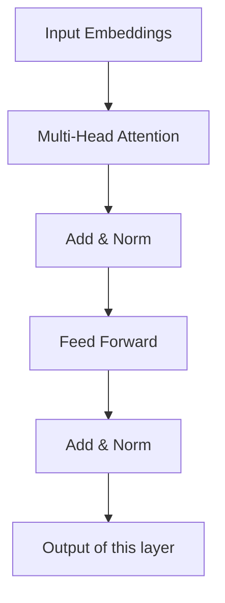

Cramming: Training a Model on a Single GPU in a Day

Note Created: 2024-01-26
Arxiv ID: 2212.14034
Title: Cramming: Training a Model on a Single GPU in a Day
Authors: Jonas Geiping, Tom Goldstein
Abstract: Recent trends in language modeling have focused on increasing performance through scaling, and have resulted in an environment where training language models is out of reach for most researchers and practitioners. While most in the community are asking how to push the limits of extreme computation, we ask the opposite question: How far can we get with a single GPU in just one day?
We investigate the downstream performance achievable with a transformer-based language model trained completely from scratch with masked language modeling for a single day on a single consumer GPU. Aside from re-analyzing nearly all components of the pretraining pipeline for this scenario and providing a modified pipeline with performance close to BERT, we investigate why scaling down is hard, and which modifications actually improve performance in this scenario. We provide evidence that even in this constrained setting, performance closely follows scaling laws observed in large-compute settings. Through the lens of scaling laws, we categorize a range of recent improvements to training and architecture and discuss their merit and practical applicability (or lack thereof) for the limited compute setting. 
Code: [jonasgeiping/cramming](https://github.com/jonasgeiping/cramming)

# Contribution of this paper

# Input mode
   Text

   
# Task Type

Text
   Conversation 

   Question and Answer

   Summarize 

   Creativity 

   Translation 

   Named Entity Recognition(NER)

Sequence 
    Time series

    Forecasting 

    ODE 

    PDE

# Model

    BERT (Bidirectional Encoder Representations from Transformers)
    Bidirectional means that both the left and the right context of a word is considered when the word is processed. This is distinct from a decoder-only model, which only considers the left context of a word (see OpenAI GPT). BERT is a multi-layer bidirectional Transformer encoder.

    Transformer 

    State Space Model

    Convolution

    Fully Connected Feed Forward 

    Skip Connection 

    Recurrent Neural Network 

# Training 

This is a paper primarily about training.
## Pre-processing 

   Tokenizer 

   Added tokens

   Size of input

   Padding policy 

## Batch size

## Epochs 

## Chinchilla scale

# Benchmarks 

# Datasets 

# Inference 

# Hyperparameters

    Learning rate
    Adjustment schedule 

    Temporal discount 

    Dropout rate for back propagation

    Number of layers

    Patch size

# Training scale
    Tiny, medium, industrial 

# Novel contributiobs

# For further research 

   What is the area of exploration suggested by this paper?

# General comments 

# Bibliography 

   This paper

   Novel references 